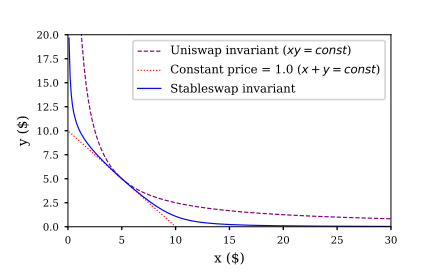
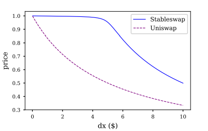

# Book on CurveV1: A Comprehensive Guide to StableSwap and its Comparison with Uniswap V2

## Introduction

### Understanding CurveV1 and StableSwap
CurveV1 is a decentralized exchange (DEX) protocol specifically designed to provide efficient trading between stablecoins. Stablecoins are cryptocurrencies that aim to maintain a stable value relative to a specific asset or basket of assets, such as the US dollar. CurveV1, through its StableSwap invariant, offers minimal slippage, making it highly efficient for large trades of stablecoins compared to traditional automated market makers (AMMs) like Uniswap V2.

### Importance of Low Slippage in Stablecoin Trading
Slippage refers to the difference between the expected price of a trade and the actual price at which the trade is executed. In the context of stablecoins, where users expect minimal price volatility, high slippage can be particularly problematic. CurveV1's design is optimized to minimize slippage, providing a more stable and predictable trading experience for users.

## CurveV1 vs. Uniswap V2: Key Differences

### Uniswap V2: The Constant Product Invariant
Uniswap V2 uses a constant product formula to maintain a balance between two assets in a liquidity pool. The formula is given by:

$$
x \times y = k
$$

Where:
- \( x \) and \( y \) represent the quantities of the two tokens in the pool.
- \( k \) is a constant.

This invariant ensures that the product of the token quantities remains constant after every trade. While this approach works well for volatile assets, it is less efficient for stablecoins, where the expected price should ideally remain close to 1:1.

### CurveV1: The StableSwap Invariant
CurveV1 introduces the StableSwap invariant, specifically designed to handle stablecoins with minimal slippage. The StableSwap invariant is a modified version of the constant product formula that behaves more like a constant sum formula near the equilibrium point, thereby reducing slippage.

The StableSwap formula can be expressed as:

$$
A \cdot n^n \cdot \sum_{i=1}^{n} x_i + D = A \cdot D \cdot n^n + \frac{D^{n+1}}{n^n \cdot \prod_{i=1}^{n} x_i}
$$

Where:
- \( A \) is the amplification coefficient, which controls the curvature of the invariant.
- \( D \) is the total amount of assets in the pool.
- \( x_i \) represents the quantity of each asset in the pool.
- \( n \) is the number of different assets in the pool.

The amplification coefficient \( A \) allows CurveV1 to adjust the curvature of the invariant, making it more efficient for stablecoins by minimizing price deviations from the ideal 1:1 ratio.

### Visual Comparison of Invariants
The following figure illustrates the difference between the Uniswap invariant and the StableSwap invariant:

In the above graph:
- The Uniswap invariant follows a hyperbolic curve (red line), leading to significant slippage as the pool becomes imbalanced.
- The StableSwap invariant (blue line) remains relatively flat near the 1:1 ratio, indicating lower slippage.

## Practical Example: Liquidity Provision, Trading, and Slippage

### Adding Liquidity to CurveV1

To add liquidity user should call the following function on the stableswap contract [add_liquidity()](https://github.com/curvefi/curve-contract/blob/b0bbf77f8f93c9c5f4e415bce9cd71f0cdee960e/contracts/pools/3pool/StableSwap3Pool.vy#L270):

`
StableSwap.add_liquidity(_amounts: uint256[N_COINS], _min_mint_amount: uint256)→ uint256
`

This function takes two arguments:
- _amounts: List of amounts of coins to deposit

- _min_mint_amount: Minimum amount of LP tokens to mint from the deposit

Returns the amount of LP tokens received in exchange for the deposited tokens.

#### Scenario
For simplicity we use equal numbers here:
Alice has 10,000 USDC and 10,000 DAI. She decides to provide liquidity to a CurveV1 pool.

#### Process
1. **Initial Pool State**: The pool initially has 50,000 USDC and 50,000 DAI.
2. **Liquidity Addition**: Alice adds her 10,000 USDC and 10,000 DAI to the pool, bringing the total pool size to 60,000 USDC and 60,000 DAI.

#### Impact on Pool and Slippage
- **No Price Impact**: Since Alice is adding an equal amount of both assets, the price remains unchanged at 1 USDC = 1 DAI.
- **Low Slippage**: The StableSwap invariant ensures that the addition of liquidity does not significantly impact the pool's balance, resulting in minimal slippage for subsequent trades.

### Removing Liquidity from CurveV1

#### Scenario
After some time, Alice decides to withdraw her liquidity.She can call remove_liquidity function here: [remove_liquidity()](https://github.com/curvefi/curve-contract/blob/b0bbf77f8f93c9c5f4e415bce9cd71f0cdee960e/contracts/pools/3pool/StableSwap3Pool.vy#L498)

`
StableSwap.remove_liquidity(_amount: uint256, _min_amounts: uint256[N_COINS])→ uint256[N_COINS]
`

This function ithdraw coins from the pool.It takes two input

- _amount: Quantity of LP tokens to burn in the withdrawal

- _min_amounts: Minimum amounts of underlying coins to receive

Returns a list of the amounts for each coin that was withdrawn.

#### Process
1. **Pool Growth**: Due to trading fees and price movements, the pool now has 65,000 USDC and 65,000 DAI.
2. **Liquidity Withdrawal**: Alice withdraws her proportional share of the pool, receiving 11,000 USDC and 11,000 DAI.

#### Impact on Pool and Slippage
- **Proportional Withdrawal**: Alice's withdrawal is proportional to her share of the pool, ensuring that the pool remains balanced.
- **Minimal Slippage**: The withdrawal does not significantly alter the pool's balance, maintaining low slippage for remaining liquidity providers.

#### Note:
In CurveV1 stableswap, users have the possibility to withdraw a single coin from the pool.In such a case the should use the following function:
[remove_liquidity_one_coin()](https://github.com/curvefi/curve-contract/blob/b0bbf77f8f93c9c5f4e415bce9cd71f0cdee960e/contracts/pools/3pool/StableSwap3Pool.vy#L670)

`
StableSwap.remove_liquidity_one_coin(_token_amount: uint256, i: int128, _min_amount: uint256)→ uint256
`

This function withdraw a single coin from the pool.It takes three input

- _token_amount: Amount of LP tokens to burn in the withdrawal

- i: Index value of the coin to withdraw

- _min_amount: Minimum amount of coin to receive

Returns the amount of coin i received.

### Trading on CurveV1
To trade coins on CurveV1, user can use this function: [exchange()](https://github.com/curvefi/curve-contract/blob/b0bbf77f8f93c9c5f4e415bce9cd71f0cdee960e/contracts/pools/3pool/StableSwap3Pool.vy#L431)

`
StableSwap.exchange(i: int128, j: int128, _dx: uint256, _min_dy: uint256)→ uint256
`
Perform an exchange between two coins.

- i: Index value for the coin to send

- j: Index value of the coin to receive

- _dx: Amount of i being exchanged

- _min_dy: Minimum amount of j to receive

Returns the actual amount of coin j received.

#### Scenario
Bob wants to swap 5,000 USDC for DAI.

#### Process
1. **Trade Execution**: Bob initiates a swap of 5,000 USDC for DAI.
2. **Price Impact**: The StableSwap invariant calculates the new quantities of USDC and DAI in the pool.

#### Impact on Pool and Slippage
- **Price Change**: The pool now holds 65,000 USDC and 60,000 DAI, slightly altering the price to reflect the change in supply.
- **Low Slippage**: Due to the StableSwap invariant, the price deviation is minimal, resulting in significantly lower slippage compared to Uniswap V2.

### Slippage Calculation Example

Let’s assume the pool started with equal amounts of 60,000 USDC and 60,000 DAI. Bob’s trade would shift the balance, leading to a slight deviation from the 1:1 ratio. In Uniswap V2, such a trade might lead to a slippage of around 1.5%, while in CurveV1, the slippage might be as low as 0.015%, thanks to the amplification factor \( A \).

## Fees

Curve exchange contracts have the capability to charge an “admin fee”, claimable by the contract owner. The admin fee is represented as a percentage of the total fee collected on a swap.

For exchanges the fee is taken in the output currency and calculated against the final amount received. For example, if swapping from USDT to USDC, the fee is taken in USDC.

Liquidity providers also incur fees when adding or removing liquidity. The fee is applied such that, for example, a swap between USDC and USDT would pay roughly the same amount of fees as depositing USDC into the pool and then withdrawing USDT. The only case where a fee is not applied on withdrawal is when removing liquidity via remove_liquidity, as this method does not change the imbalance of the pool in any way.

In production to get the pool fees you must call the `fee()` getter function.

`
StableSwap.fee()→ uint256: view
`

The pool swap fee, as an integer with 1e10 precision.

And to get the admin fesss we call  the `admin_fee()` getter function.

`
StableSwap.admin_fee()→ uint256: view
`

The percentage of the swap fee that is taken as an admin fee, as an integer with 1e10 precision.

Admin fee is set at 50% of pool fees and is paid out to veCRV holders

## Conclusion

### Why Choose CurveV1 for Stablecoin Trading?
CurveV1 offers a highly efficient and stable platform for trading stablecoins with minimal slippage. Its unique StableSwap invariant and amplification factor make it superior to traditional AMMs like Uniswap V2 when dealing with assets that require price stability. For liquidity providers and traders looking to minimize risk while maximizing returns, CurveV1 represents a significant innovation in decentralized finance.

---

## Sources used to write this paper includes:
- Stableswap whitepaper: StableSwap - efficient mechanism for Stablecoin liquidity by Michael Egorov, November 10, 2019
- CurveV1 github repo: https://github.com/curvefi/curve-contract/blob/master/contracts/pools/3pool/StableSwap3Pool.vy
- Curve documentation: https://curve.readthedocs.io/exchange-pools.html
